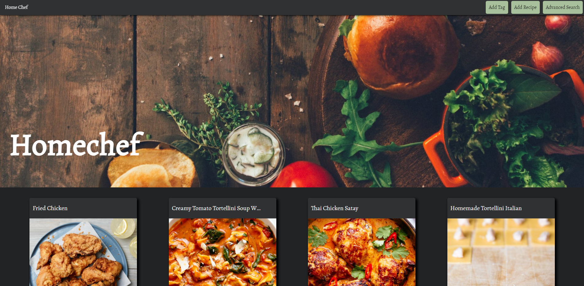

# Homechef

*A place to curate recipes recipes found in the wild in one place! A digital collection of recipes! Get yourself running an instance of Homechef for free on heroku and browse recipes you have added in the past via the tag search method. Find the modifications and secret touches you made to the recipes you cooked! Keep track of your cooking journey*
 
## Installation
Download the repository
`git clone <repository_url>`

Setup a virtual environment
`python -m venv env`

Use pip to install the required libraries
`pip install -r requirements.txt`

## Framework
Python
Flask
